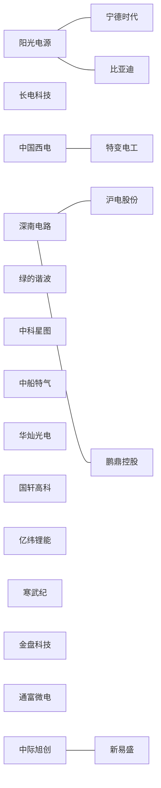

# 研究知识图谱

共 **781 篇研报**，覆盖 **104 个行业标签**。

## 行业分类

- [[3-行业索引/半导体|半导体]]（74篇）
- [[3-行业索引/AI与算力|AI与算力]]（82篇）
- [[3-行业索引/新能源|新能源]]（71篇）
- [[3-行业索引/机器人|机器人]]（17篇）
- [[3-行业索引/医药健康|医药健康]]（20篇）
- [[3-行业索引/航天军工|航天军工]]（22篇）
- [[3-行业索引/电力设备|电力设备]]（17篇）
- [[3-行业索引/基础工业|基础工业]]（30篇）

## 核心公司关系图

## 热门标签

- #AI算力（43篇）
- #储能（30篇）
- #AI应用（22篇）
- #半导体材料（21篇）
- #动力电池（20篇）
- #PCB（18篇）
- #光模块（18篇）
- #精细化工（17篇）
- #商业航天（16篇）
- #人形机器人（16篇）
- #光伏（15篇）
- #新能源汽车（14篇）
- #封测（13篇）
- #消费电子（13篇）
- #锂电池（13篇）
- #特高压（12篇）
- #卫星通信（11篇）
- #晶圆代工（11篇）
- #化工（10篇）
- #AI芯片（10篇）